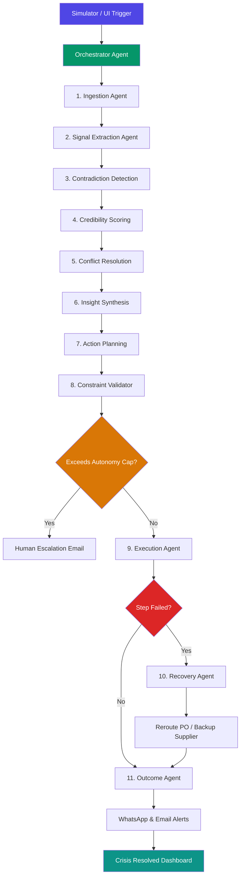

# SupplyPulse: Multi-Agent Autonomous Pipeline Mechanics

This document provides a highly detailed walkthrough of the closing-loop operations, decision engines, and individual specialized agents that govern the **SupplyPulse** autonomous supply chain pipeline.

---

## 1. Pipeline Lifecycle Overview

The SupplyPulse pipeline functions as an event-driven, autonomous self-healing execution loop. A cycle is initiated either by the background stock simulator (when stock falls below safety levels) or via manual trigger from the frontend interface. Once triggered, the **Orchestrator Agent** coordinates an 11-stage pipeline, streaming tracing updates in real time to organization tenants via WebSockets (Socket.IO).

---

## 2. In-Depth Agent Specifications

Every specialized agent runs inside a dedicated execution context, utilizing Groq LLM reasoning (powered by `llama-3.3-70b-versatile` with low temperature and structured JSON outputs) or falling back to transaction-compliant mock state arrays if API keys are absent.

### 🛡️ Ingestion Agent
*   **Purpose**: Gathers and normalizes structured and unstructured data across 5 distinct system adapters:
    1.  `warehouse.csv` (Warehouse Spreadsheet recount data)
    2.  `pos.feed` (Real-time Point of Sale shelf metrics)
    3.  `supplier.email` (Supplier transit logs and emails)
    4.  `complaints.feed` (Zendesk customer complaints)
    5.  `news.scrape` (Scraped online logistics and disruption feeds)
*   **Logic**: Normalizes raw data parameters into a unified format, flags discrepancies, and sets a preliminary credibility score.

### 🔍 Signal Extraction Agent
*   **Purpose**: Extracts operational signals (demand velocity, logistics disruption vectors, supply gaps, and risk flags).
*   **Logic**: Applies temporal weighting (penalizing older data) and outputs specific, actionable operational signals citing respective source IDs.

### ⚖️ Contradiction Detection Agent
*   **Purpose**: Scans extracted signals and explicitly flags mismatches in claimed metrics (e.g. stock quantities, ETAs, shelf availabilities).
*   **Logic**: Highlights the magnitude of the contradiction (minor, moderate, severe) and outlines the negative business impact if left unresolved.

### 📊 Credibility Scoring Agent
*   **Purpose**: Dynamically evaluates the validity of conflicting data sources.
*   **Logic**: Computes a weighted credibility rating based on 5 dimensions (each scored 0.0 to 1.0):
    $$\text{Final Score} = (\text{Recency} \times 0.3) + (\text{Reliability} \times 0.25) + (\text{Corroboration} \times 0.2) + (\text{Specificity} \times 0.15) + (\text{Plausibility} \times 0.1)$$
    *   *Default Reliability Weightings*: POS (`0.90`), Complaints (`0.75`), Emails (`0.65`), Warehouse (`0.55`), News Scrapes (`0.35`).

### 🗳️ Conflict Resolution Agent
*   **Purpose**: Establishes a singular, absolute ground truth.
*   **Logic**: Picks the highest-credibility source to resolve conflicting metrics, queues administrative data adjustments (e.g., triggering a physical recount if warehouse stock is stale), and generates a definitive system state.

### 📝 Insight Synthesis Agent
*   **Purpose**: Translates analytical findings into standard business terms.
*   **Logic**: Outputs the root-cause analysis, revenue exposed, and sets the system recommendation (`autonomous_execute` or `escalate_to_human`).

### 🗺️ Action Planning Agent
*   **Purpose**: Formulates an action chain to mitigate the crisis.
*   **Logic**: Constructs a dependent, ordered 5-step action list detailing action types, tools, costs, and timings.

### 🛠️ Constraint Validator Agent
*   **Purpose**: Guards operational constraints and budget safety caps.
*   **Logic**: Approves, modifies, or rejects planned actions. If costs exceed tenant limits (e.g., >PKR 500,000), it flags the pipeline to trigger a **Human Escalation Alert** via email.

### ⚡ Execution Agent
*   **Purpose**: Performs the physical integrations.
*   **Logic**: Executes PO creations, schedules inventory counters, triggers bulk emails to suppliers, sends WhatsApp alerts to retailers, and streams state logs to the client UI.

### 🩺 Recovery Agent
*   **Purpose**: Implements autonomous self-healing when execution actions fail.
*   **Logic**: If an action fails (e.g., Supplier A is unresponsive or factory strikes are confirmed), it searches the database, drafts and activates a backup standby PO with Supplier B, re-checks budget caps, and applies the recovery route.

### 📈 Outcome Agent
*   **Purpose**: Summarizes systemic performance.
*   **Logic**: Calculates before-and-after states, total protected revenue, final opex cost, and counts autonomous decisions to generate the final dashboard outcomes.

---

## 3. Real-world Autonomous Scenarios

### Scenario A: Resolving Phantom Inventory (WH vs. POS)
*   **The Conflict**: Warehouse system reports 412 units of Lays Masala in stock. The POS feed reports only 142 units remaining, while Zendesk complaints report that shelves are empty at 6 major retail outlets.
*   **The Resolution**: The pipeline scores the real-time POS feed (`0.91`) and customer complaints corroboration (`0.78`) highly, while downgrading the stale warehouse recount (`0.37`). The system declares an actual stock of 142 units, flags the system discrepancy as a "Phantom Inventory Conflict," and initiates an immediate restock PO.

### Scenario B: Self-Healing PO Rerouting
*   **The Disruption**: The primary PO is dispatched to Pepsi Direct. The Execution Agent encounters an API error (representing worker industrial action/unresponsive portals).
*   **The Recovery**: The **Recovery Agent** intercepts the failure, checks the secondary database, finds Mehran Foods (Supplier B) has standby stock, validates that the higher opex cost (PKR 800/unit vs PKR 780/unit) fits within the tenant's safety budget, drafts a backup PO, and completes the transaction autonomously.
