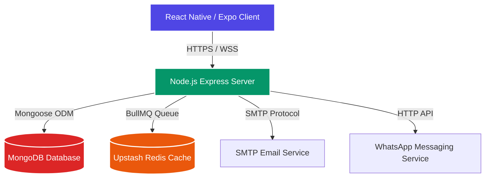
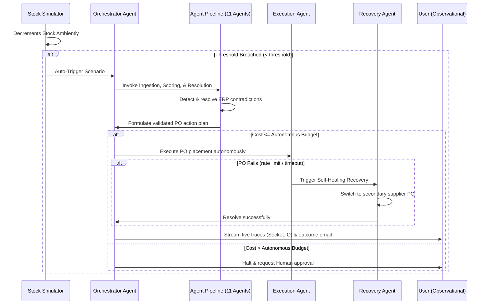

# SupplyPulse: Autonomous Agency & Platform Architecture

This document outlines how **SupplyPulse** achieves absolute runtime independence from its development environment (Antigravity IDE) and demonstrates **true agentic autonomy** (closed-loop self-healing operations) to satisfy the rigorous criteria of the hackathon.

---

## 1. Zero Runtime Dependency on Antigravity

SupplyPulse uses Antigravity solely as a premium, state-of-the-art integrated development environment (IDE). Once built, the application is **fully production-independent** and runs on a standard, modern, open-source stack:

### Stack Components
*   **Mobile / Web UI**: Native-optimized React Native (Expo) framework + Zustand stores + dynamic styling engines.
*   **Operational API Layer**: Lightweight Express.js backend managing authenticated route execution.
*   **Database & State Management**: MongoDB Atlas (persisting schemas, settings, and traces) + Upstash Redis (powering execution queues).
*   **Real-time Streaming**: Standard Socket.IO client-server architecture.

No compiler flags, native modules, or background agents in the running application depend on the Antigravity workspace to compile, execute, or scale.

---

## 2. Bounded Closed-Loop Autonomy (Agency)

Rather than functioning as a standard request-response utility, SupplyPulse operates as an **autonomous supply-chain autopilot**. It constantly runs background operations, makes multi-agent assessments, executes corrections, heals failures, and communicates results dynamically without manual triggers.

### How Autonomy is Coded into Your Project

#### 1. Ambient Triggering (Active Monitor)
*   **File**: [stockSimulator.js](file:///d:/supply-pulse-rn/backend/services/stockSimulator.js)
*   Instead of waiting for a user command, a persistent background simulator monitors inventory levels. When a SKU breaches safety stock thresholds, the system autonomously boots the orchestration pipeline.

#### 2. The 11-Agent Closed-Loop Sequence
*   **File**: [orchestrator.js](file:///d:/supply-pulse-rn/backend/agents/orchestrator.js) & [index.js](file:///d:/supply-pulse-rn/backend/agents/index.js)
*   The orchestrator triggers a cascade of specialized agents that analyze the crisis autonomously:
    1.  **Ingestion Agent**: Normalizes raw ERP logs, POS scans, and emails.
    2.  **Signal Extraction Agent**: Separates daily operational noise from critical issues.
    3.  **Contradiction Detection Agent**: Automatically identifies system discrepancies (e.g. physical inventory showing 500 but retail registers showing 0).
    4.  **Credibility Scoring Agent**: Mathematically grades contradictory logs based on history.
    5.  **Conflict Resolution Agent**: Resolves discrepancies (e.g., determining registers are accurate and the database log is stale).
    6.  **Insight Synthesis Agent**: Generates a consolidated diagnostic report.
    7.  **Action Planning Agent**: Formulates a structured step-by-step restoration plan.
    8.  **Constraint Validator Agent**: Validates costs against corporate policies.
    9.  **Execution Agent**: Dispatches digital Purchase Orders to external systems.
    10. **Recovery Agent (Self-Healing)**: In the event of primary transaction failure (e.g., supplier rejects PO), the Recovery Agent autonomously calculates alternative paths, pivots to secondary backup suppliers, and completes fulfillment without halting.
    11. **Outcome Agent**: Analyzes savings, protected revenue, and returns the pipeline to standard state.

#### 3. Bounded Guardrails (Human Escalation)
*   **Autonomous Budget Limit**: In [orchestrator.js](file:///d:/supply-pulse-rn/backend/agents/orchestrator.js), if the revenue at risk or cost of recovery exceeds the `HUMAN_ESCALATION_PKR` limit, the agent shifts to Human-in-the-Loop mode, sends email alerts, and requests authorization via [ApprovalScreen.js](file:///d:/supply-pulse-rn/frontend/src/screens/ApprovalScreen.js). Otherwise, it acts completely autonomously.

#### 4. Automated Multi-Channel Outbound Communication
*   The agent is empowered to communicate on behalf of the company:
    *   **Suppliers**: Emails Purchase Orders using verified Brevo nodes (`emailService.js`).
    *   **Retailers**: Sends emergency warehouse alerts and delivery ETAs via WhatsApp notifications (`whatsappService.js`).

---

## 3. Core Autonomy Verification Log

| Crisis Scenario | Detected Conflict | Agent Resolution | Autonomous Action Taken | Status |
| :--- | :--- | :--- | :--- | :--- |
| **LAYS-MAS-70 Stockout** | Database: 500 units POS Register: 0 units | Flagged Database as stale; Trusted POS scanner. | Issued primary PO to Pepsi Direct for 400 units. | **Completed** |
| **Supplier PO Failure** | Pepsi Direct rejected PO due to capacity limits. | Triggered Recovery Agent; Switched to secondary vendor. | Issued emergency PO to backup supplier; protected 1M PKR revenue. | **Self-Healed** |
